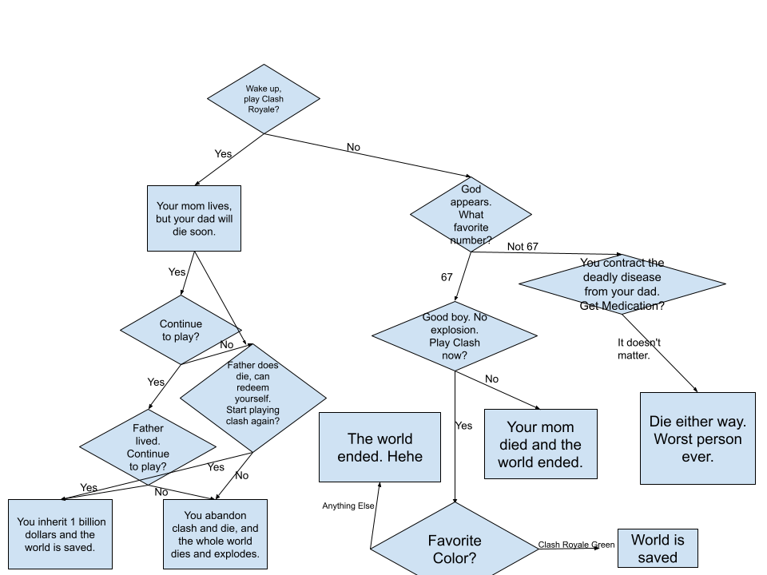
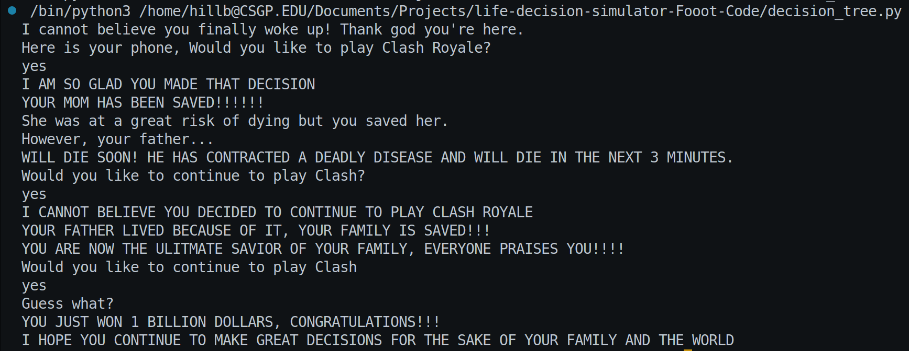

# Choose Your Own Adventure
Welcome to the Clash Royale Interactive Story Game!
This is a fun, text-based Python game where your choices directly affect the storyline.
You will face bizarre scenarios, save (or doom) your family, and possibly win 1 billion dollars, all based on your decisions.
## Overview
This project is a Python program that:
- Presents a branching choose-your-own-adventure story.
- Uses user input to decide what happens next.
- Includes dramatic pauses using Python's time.sleep() to build suspense.
- Demonstrates Python fundamentals like:
    - if/elif/else statements
    - input() handling
    - String methods such as .lower()  

Here's a flowchart which explains the way my program works

## Requirements
- Python 3.0 or higher
- Builtin time library
- Git
## How to Install and Run
- Clone repo using ```git clone {FOLDER-NAME}/https://github.com/WTCSC/life-decision-simulator-Fooot-Code.git```
- Open the folder where the decision simulator is located (ex. ```cd lifeDecisionsSimulator```)
- Run decision_tree.py in the terminal:  
```python decision_tree.py```
or  
```python3 decision_treen.py```

## How to Play
1. Run the program using instructions above
2. Read the prompts carefully.
3. Type responses when asked.
    - Example inputs: yes, no, 67
4. Watch how the story unfolds based on your decisions.

## Example Run Through
Here's a run through of the simulator that is the very left path of the flowchart, or continuing to play Clash Royale the whole time  



